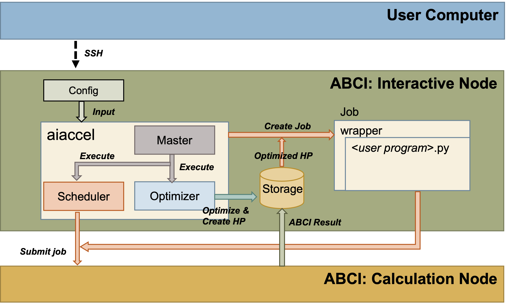
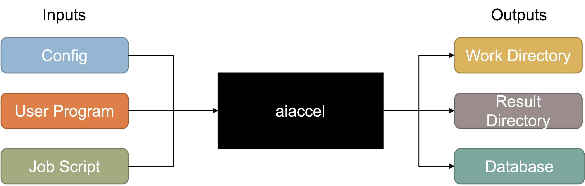
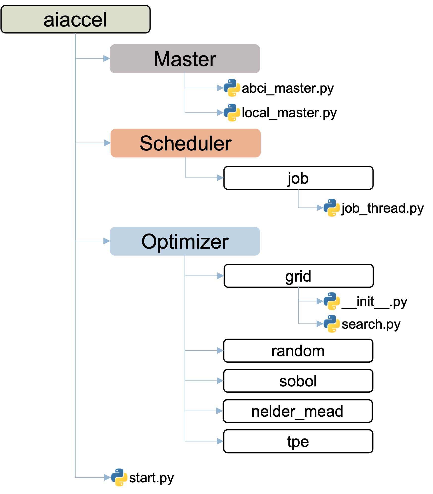
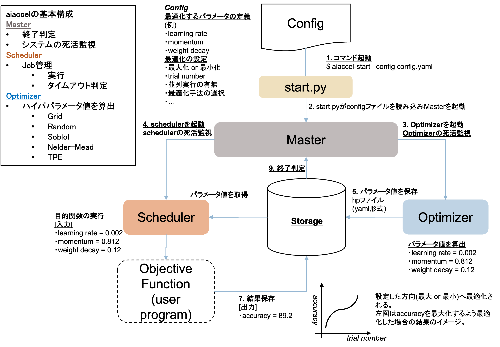

# aiaccelの概要
`aiaccel` は，最適なハイパパラメータの組み合わせを見つけ出すハイパパラメータ最適化ライブラリです．
`aiaccel` は，`ABCI`のインタラクティブノード上で実行することを想定しています．
`ABCI`については，[ABCI User Guide](https://docs.abci.ai/ja/)を参照ください．

また，ローカル環境でも利用可能です．

`aiaccel` は，内部状態や最適化結果をデータベースで管理します．最適化対象のプログラム(ここでは `User Program`と呼称)の実行タスクを `ABCI` の計算ノードに渡し，結果をデータベースに保存します．



## aiaccelの入出力



- 入力
  - `Config` - コンフィグレーションファイルです．最適化のパラメータの設定，最適化アルゴリズムの設定，最適化対象(`User Program`)等を記述します．コンフィグレーションファイルは，`Yaml` または `JSON` 形式で記述します.
  <br>
    - 例：`examples/sphere/config.yaml` を参照ください．

  - `User Program` - 最適化対象のプログラムです．<br>
    - 例： `examples/sphere/user.py` を参照ください．

  - `Job Script` - ジョブスクリプトファイルです．
  ジョブスクリプトファイルは，`ABCI` で実行するジョブを記述します．
  `aiaccel` は，指定したジョブスクリプトファイルを元に，新たにジョブスクリプトファイルを生成します．ここで指定するジョブスクリプトは，`load module` などの事前処理を記述します．
    - 例： `examples/sphere/job_script_preamble.sh` を参照ください．


- 出力
  - `Work Directory` - `aiaccel` 実行時に生成されるワークディレクトリです(以下，`work` と記述します)．
  `work` はコンフィグレーションファイルで指定したパスに生成されます．既に同名のディレクトリが存在する場合は実行を中止します．

  - `Result Directory` - 実行結果を保存します．過去の実行結果は全てここに保存されます．

  - `Database` - aiaccelの内部状態の管理・実行結果を保存するデータベースです．
  `work/storage/storage.db` に生成されます．
  データベースは `sqlite3` を採用しています．


## aiaccelの構成モジュール



- Optimizer
  - 最適化アルゴリズム
    - grid search
    - random
    - sobol sequence
    - nelder-mead
    - tpe
    - mo-tpe

- Manager
  - ジョブスケジューラ．`Optimizer` が生成したハイパパラメータを元にジョブを生成し，計算ノードにジョブを投入します．


## aiaccelの処理フロー



1. `aiaccel-start`コマンドからコンフィグレーションファイルのパスを入力として指定して実行します．
2. `start.py`がコンフィグレーションファイルをロードし，`Optimizer` と `Manager` を生成します．
3. `Optimizer` はコンフィグレーションファイルからハイパパラメータの情報を読み込み，最適化アルゴリズムに基づきハイパパラメータを生成し `Database` に保存します．
4. `Manager` は `Database` から新しいハイパパラメータを読み込み，コンフィグレーションファイルに基づき指定の計算ノードで `User Program` を実行するジョブスクリプトファイルを生成し，計算ノードにジョブを投入します．
5. `User Program` の処理が終了すると，`aiaccel` が `User Program` の結果を `Database` に保存します．
6. 3-5 の一連の処理をトライアルと言います．コンフィグレーションファイルで指定したトライアル数に到達するまで繰り返し実行します．
7. 全てのトライアルが完了すると `aiaccel` は停止します．


## start.py

`aiaccel` は `aiaccel-start` コマンドで実行を開始します． `aiaccel-start`は，`aiaccel/cli/start.py` を実行します．


`Optimizer`，`Manager`，の初期化は以下のコードで行われます．

```python
    Optimizer = create_optimizer(args.config)
    Manager = create_manager(args.config)
```

初期化されたモジュールは，以下のコードで実行されます.
`pre_process()` で初期化し，`inner_loop_main_process()` でメインループでの処理を実行し，`post_process()` で終了処理を行います．

```python
    modules = [Optimizer, Manager]
    for module in modules:
        module.pre_process()

    while True:
        for module in modules:
            if not module.inner_loop_main_process():
                break
            if not module.check_error():
                break
            module.loop_count += 1
        else:
            time.sleep(sleep_time)
            continue
        break

    for module in modules:
        module.post_process()
```


## 2. Optimizer
`Optuiizer` クラスは，`aiaccel/module.py` の `AbstractModule` クラスを継承しています．
`Optimize` は `create_optimizer()` で初期化されます．
コンフィグレーションファイルで設定した最適化アルゴリズムが読み込まれます．

```python
Optimizer = create_optimizer(args.config)
```
- 最適化アルゴリズム
    - grid search
    - random
    - sobol sequence
    - nelder-mead
    - tpe
    - mo-tpe

### RandomOptimizerの例

`RandomOptimizer` は，`AbstractOptimizer`クラスを継承し，`generate_parameter()`メソッドをオーバーライドしています．
`generate_parameter()` は，最適化アルゴリズム毎にオーバーライドし，固有の処理を記述します．

```python
    def generate_parameter(self) -> list[dict[str, float | int | str]]:
        """Generate parameters.

        Returns:
            list[dict[str, float | int | str]]: A list of created parameters.
        """
        new_params = []
        for param in self.params.sample(self._rng):
            new_params.append({"parameter_name": param["name"], "type": param["type"], "value": param["value"]})

        return self.params.to_original_repr(new_params)
```


### 3. Manager

`Manager` クラスは，`aiaccel/module.py` の `AbstractModule` クラスを継承しています．
`Manager` は `create_manager()` で初期化されます．
コンフィグレーションファイルで設定したジョブスケジューラが読み込まれます．

```python
Manager = create_manager(args.config)
```

- ジョブスケジューラ
    - `ABCI` - `ABCI`での実行
    - `Local` - ローカル環境での実行．このモードではスケジューラとしての機能はなく，`User Program` を直接実行します．
    - `Python_Local` - `User Program` が `Python` ファイルである時に指定可能なモードです．このモードではスケジューラとしての機能はなく，`User Program` を直接実行します．

