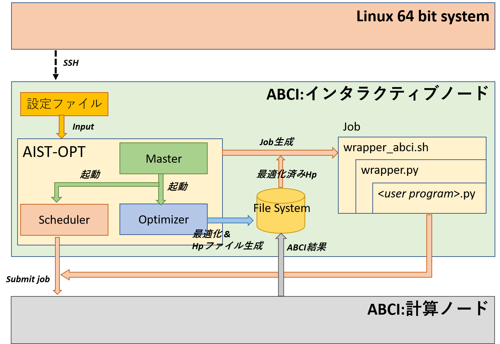
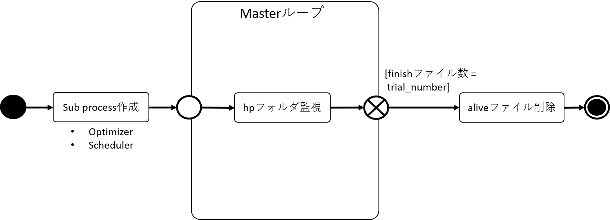
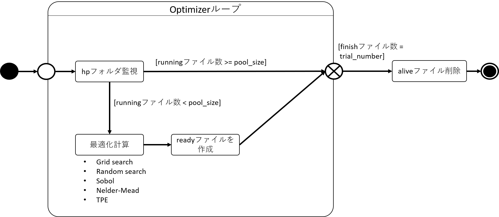
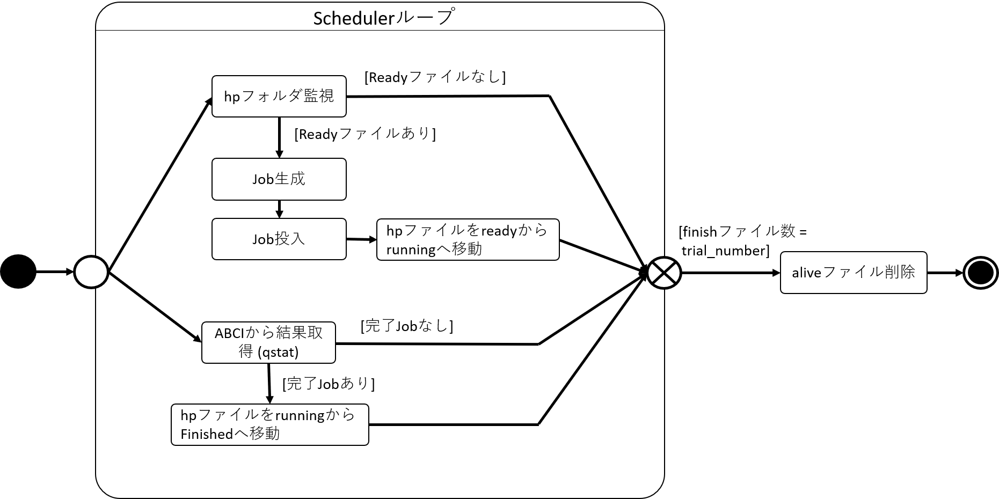

# 概略 AIST-OPT
`aiaccel`とは，ハイパーパラメータを自動最適化するためのソフトウェアです．`aiaccel`は`ABCI`のリソースにアクセスします．
深層学習モデルなど高コストなモデルのハイパーパラメータ最適化に適しています．
 
- システム構成図 
  
 

- ご参考
  - AI橋渡しクラウド（AI Bridging Cloud Infrastructure、ABCI) は、国立研究開発法人 産業技術総合研究所が構築・運用する、世界最大規模の人工知能処理向け計算インフラストラクチャです。
  - https://abci.ai/ja/about_abci/
 

## ソフトウェア概要
aiaccelは3つのモジュールで構成されています．
- **`Master`** - ツールの死活監視を行うモジュールです．
- **`Optimizer`** - 最適化計算を行うモジュールです．
- **`Scheduler`** - Jobを作成し，ABCIにJobを投入するモジュールです．
  
`aiaccel`は，`hpファイル`で内部状態を管理しています．
`hpファイル`とは，ハイパーパラメータ値を記述したyaml形式のテキストファイルです．`hpファイル`1つにつき，ABCIに投入する1つのJob情報を保有しています.
`hpファイル`は，`ワーキングディレクイトリ`下の`hp`フォルダに格納されます．

hpフォルダは，`ready`, `running`, `finish`の3つのフォルダで構成されています．
 - **`ready`** - ABCIに投入予定のJob(hpファイル)がreadyフォルダに格納されます．
 - **`running`** - ABCIで実行中のJob(hpファイル)がrunningフォルダに格納されます．
 - **`finish`** - 完了したJob(hpファイル)がfinishフォルダに格納されます．

各モジュールの役割は以下の通りです．

### Master
- 起動と死活監視
 

### Optimizer
- 最適化計算
 

### Scheduler
- Jobの作成，投入
 

